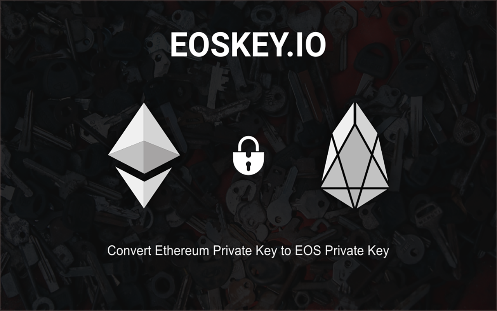

# EOS Key



>Forgot to register your EOS?   
>
>Is registration too complicated?
>
>Scared of missing airdrops by keeping tokens on Binance?

Your friendly neighbourhood block producer candidate **EOS Cafe Calgary** is back again with another tool to make your lives easier!

Introducing **EOSKEY.IO**, a tool to convert your Ethereum private keys to EOS private keys, which can be run **FULLY OFFLINE** to create EOS Mainnet Keys with **NO REGISTRATION NEEDED**.


You only need to meet 2 requirements:  
  1. Have not have registered your EOS tokens yet
  2. Have atleast one outgoing transaction from your ethereum account

The tool is available for Web Browsers, MacOS, Windows and Linux.

For our global supporters, we have made the app available in English, Spanish, Mandarin and Korean!

# Instructions
To use the tool, all you have to do is:
1. Head on over to [EOSKEY.IO](http://eoskey.io).
2. Download offline version for your platform and turn off your internet.
3. Generate your mainnet EOS keys!

It is that simple :)


# Error
```No parser and no file path given, couldn't infer a parser.```
To solve look at [StackOverflow](https://stackoverflow.com/questions/50561649/module-build-failed-error-no-parser-and-no-file-path-given-couldnt-infer-a-p)
